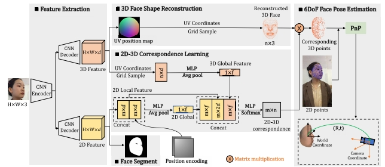

# Toward 3D Face Reconstruction in Perspective Projection: Estimating 6DoF Face Pose From Monocular Image
   
[](https://arxiv.org/pdf/2205.04126v2.pdf)

This repository contains the official PyTorch implementation of:

**Toward 3D Face Reconstruction in Perspective Projection: Estimating 6DoF Face Pose From Monocular Image**   

 

## Installation

**Install libs**

  1.Please follow this [instruction](lib/mesh/README.md).
  
  2. Please follow this [instruction](lib/mesh_p/README.md).
  
  3. Please follow this [instruction](lib/Sim3DR/README.md).
  
 **Setup python 3.7 environment**
 
   pytorch, numpy, opencv 


## Demo

coming soon
  
## Download Dataset

coming soon

## Testing

**Download our pretraind model from (link coming soon)**

​	Put this model in the folder `./checkpoint/run1/latest_net_R.pth`. 
    
**Testing**  
    ```sh
     $ python -u test.py --image_size=192 --model perspnet --dataset_mode arkit --csv_path_test 'test.csv'  
    ```

## Citation

```latex
@ARTICLE{10127617,
  author={Kao, Yueying and Pan, Bowen and Xu, Miao and Lyu, Jiangjing and Zhu, Xiangyu and Chang, Yuanzhang and Li, Xiaobo and Lei, Zhen},
  journal={IEEE Transactions on Image Processing}, 
  title={Toward 3D Face Reconstruction in Perspective Projection: Estimating 6DoF Face Pose From Monocular Image}, 
  year={2023},
  volume={32},
  number={},
  pages={3080-3091},
  doi={10.1109/TIP.2023.3275535}}
```
 


 
 
  